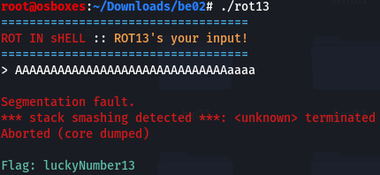

# BE02
## BRIEFING

Download the file and find a way to get the flag.

Contents: rot13

## Solution

We are provided with an executable file that performs a ROT13 operation on input we provide. I input a bunch of A's which trigged a segmentation fault and I was immediately given the flag:

The flag is **luckyNumber13**.
