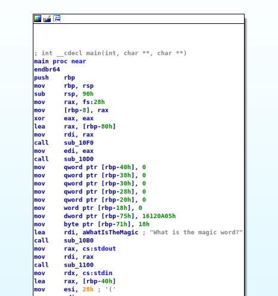
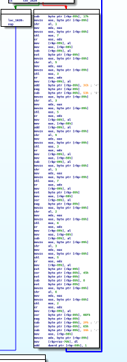
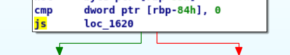
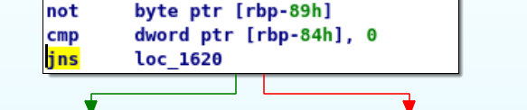
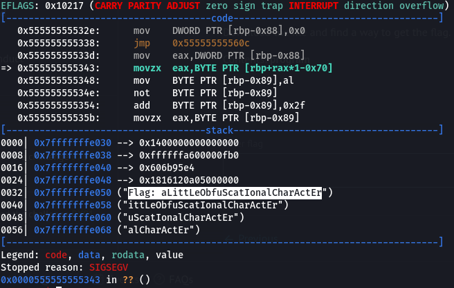

# BH01
## BRIEFING
Download the file and find a way to get the flag.

Contents: program

## Solution

I believe I solved this one in an unintended manner. I first ran the program to see what I was working with:

```console
root@osboxes:~/Downloads/bh01# ./bh01
What is the magic word?
asdf
�:�lO?d#����*���E	
Did you understand that?
```

I tried a few short inputs and got the same output each time. During the competition I didn't notice that ouput could vary based on input. I suspected that there was a specific magic word we might need. I went ahead and opened the program in IDA (free version). IDA stands for Interactive DisAssembler, which is a disassembler for computer software which generates assembly language source code from machine-executable code. I like IDA because it displays the different functions of a program in a visually appealing format and draws arrows between blocks to tell you where one function points to another.

I immedatiately honed in on the main function:



Inside the main function I found what appeared to be an encrypt function and a decrypt function.

Encrypt:


Decrypt:



I noticed that, when executed, the program only ran through what I had guessed was the encrypt function. I decided to patch the final instruction of the encrypt function to re-direct the program into what I had guessed was the decrypt function.



I changed the instruction from `js` to `jns`:



I then applied the patch and re-ran the program:

```console
root@osboxes:~/Downloads/bh01# ./bh01_ida 
What is the magic word?
asdf
Segmentation fault
```

I got a `Segmentation fault`. Since I was pretty confident I had applied the patch correctly I decided to run the program in `gdb` to see if the flag might be located in memory. Sure enough:



The flag is **aLittLeObfuScatIonalCharActEr**.
