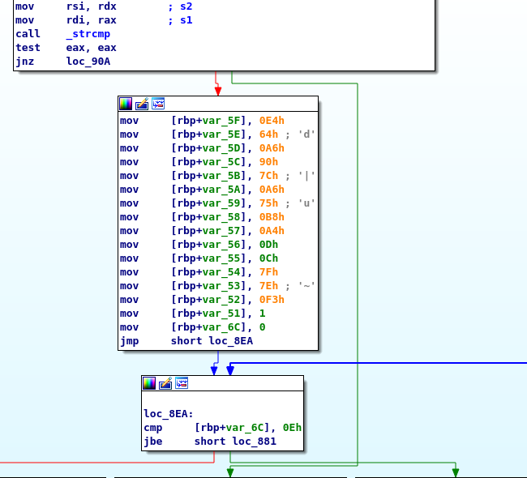

# BM01
## BRIEFING
Download the file and find a way to get the flag.

Contents: program

## Solution

I began by running the program. The program requested input, so I provided one:

```console
root@osboxes:~/Downloads/bm01# ./bm01
Какой пароль？
> asdf
неверный.
```

If we go to Google Translate we find that `Какой пароль？` is Russian for `What password?` and `неверный` translates to `incorrect'. This led me suspect that if we found the correct password we could get the flag.

I opened the program in Interactive DisAssembler (IDA) and to get a feel for the program flow. Within the `main` function I noticed a call to `strcmp` which I guessed was comparing my input to the desired input. Directly beneath this I noticed that there was a block that was skipped over for an incorrect input. I guessed that if I simply directed program flow through that block I might get the flag:



I converted the `jnz` jump found right after the call to `strcmp`:


To `jz`:

I applied the patch to the input file and then re-ran it. This time, as long as I input at string that was NOT the correct password, the program would flow through the block that required a correct password:

```console
root@osboxes:~/Downloads/bm01# ./bm01_ida
Какой пароль？
> asdf
верный!

флаг: wh1te%BluE$R3d
```

The flag is **wh1te%BluE$R3d**.
