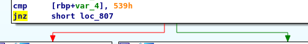
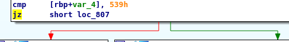

# BM02
## BRIEFING
Download the file and find a way to get the flag.

Contents: program

## Solution

I started by running the provided executable: 

```console
root@osboxes:~/Downloads/bm02# ./bm02
I'm not going to make it that easy for you.
root@osboxes:~/Downloads/bm02# 
```

Based on the ouput I suspected this challenge might be solveable via patching. I opened it in Interactive DisAssembler (IDA) and went to the main function:


It was readily apparent that if we re-directed the program to execute the block on the left that called the `printFlag` function as opposed to the block on the right that printed `I'm not going to make it that easy for you` we would probably get the flag. So I did just that.

I modifed the `jnz` instruction to be `jz` in order to modify the block the program would execute.

I changed this:


To this:


I applied the patch to the program and ran it again:

```console
root@osboxes:~/Downloads/bm02# ./bm02_ida
Flag: patchItFixIt
```

The flag is **patchItFixIt**.
