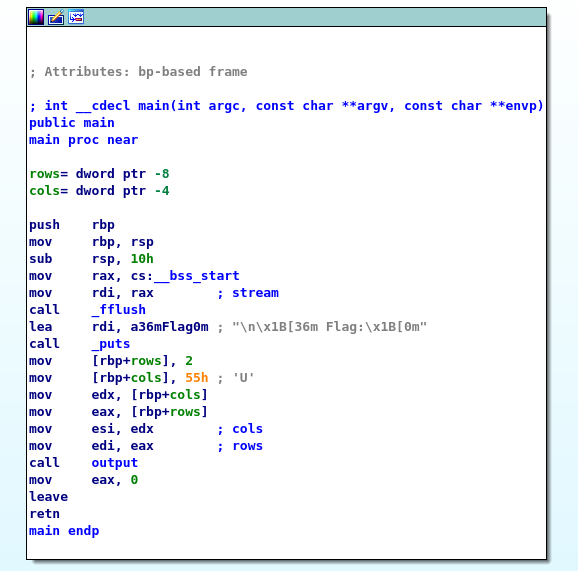

# BM03
## BRIEFING
Download the file and find a way to get the flag.

Contents: flag

## Solution

When I first rang the `flag` program it was apparent that the program printed the flag, however there was a catch, only part of the flag was printed.

```console
root@osboxes:~/Downloads/bm03# ./flag

 Flag:
       __       __                          _                      ____ __           
  ____/ /___   / /_   __  __ ____ _ ____ _ (_)____   ____ _       / __// /_ _      __
 Error displaying rest of flag
```

I pulled the program up in Interactive DisAssembler (IDA) to see if I could make sense of what was going on.



I took a look at both the `main` function and the `output` functio and determined the the program was printing only 2 of 6 lines of the flag. In the main function I decided to apply a patch where the number of rows was set to 2, changing it to 6.

Initially, 2 rows were printed by the program:


I applied a patch to turn the 2 into a 6:

Now, in theory, all 6 rows will be printed:

I applied the patch and re-ran the program:

```console
root@osboxes:~/Downloads/bm03# ./flag_ida

 Flag:
       __       __                          _                      ____ __           
  ____/ /___   / /_   __  __ ____ _ ____ _ (_)____   ____ _       / __// /_ _      __
 / __  // _ \ / __ \ / / / // __ `// __ `// // __ \ / __ `/      / /_ / __/| | /| / /
/ /_/ //  __// /_/ // /_/ // /_/ // /_/ // // / / // /_/ /      / __// /_  | |/ |/ / 
\__,_/ \___//_.___/ \__,_/ \__, / \__, //_//_/ /_/ \__, /______/_/   \__/  |__/|__/  
                          /____/ /____/           /____//_____/                     
```

The flag is **debugging_ftw**.


