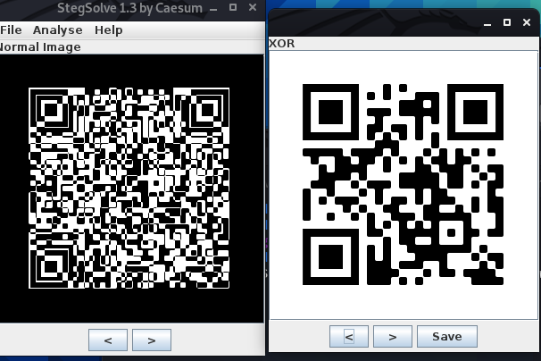

# CM01
## BRIEFING
Download the file and find a way to get the flag.

Contents: code.png, frame.png

## Solution

I didn't figure this one out during the competition, but it turns out when you XOR `code.png` with `frame.png` you get a new image that is a valid QR code.

Initially running `zbarimg` against `frame.png` gave us the following message:

```console
root@osboxes:~/Downloads/cm01# zbarimg frame.png 
QR-Code:Hey, I've put the flag into the other file using the same trick we always use.  You know what to do. :)
```

If we try to run `zbarimg` against `code.png` it fails, as we might expect just by visual inspection:

```console
root@osboxes:~/Downloads/cm01# zbarimg code.png 
scanned 0 barcode symbols from 1 images in 0.02 seconds


WARNING: barcode data was not detected in some image(s)
```

Via `stegsolve` we can get the new image:



NOW we can use `zbarimg` and extract the flag:

```console
root@osboxes:~/Downloads/cm01# zbarimg solved.png 
QR-Code:FLAG: A_Code_For_A_Code
```

The flag is **A_Code_For_A_Code**.
