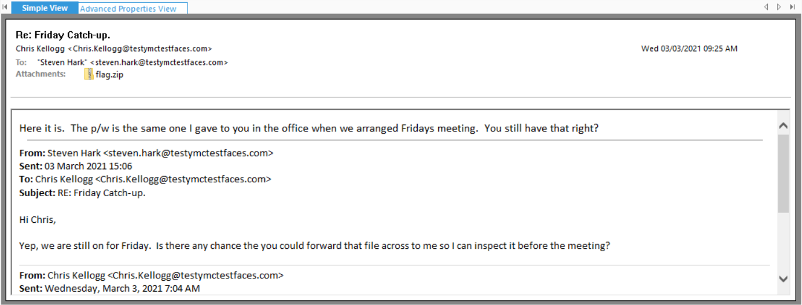

# FE01
## BRIEFING
Download the file and find a way to get the flag.

Contents: fe01.ost

## Solution

After initially attempting to simply open the .ost file in Outlook (and it not working) I found a tool called Kernel OST Viewer which made short work of opening the file.

I perused the mailbox directories a little bit and came across an interesting looking string in a meeting withing the Calendar section:

Moving on, I scrolled through the emails in the Inbox and found one containing an attachment called flag.zip:

I double-clicked on the attachment and it opened up. I tried to extract the .jpg file within and was prompted for a password.

I entered the string from the Calendar meeting and the .zip file unzipped successfully.

The flag is **pst_i'm_in_here!**
