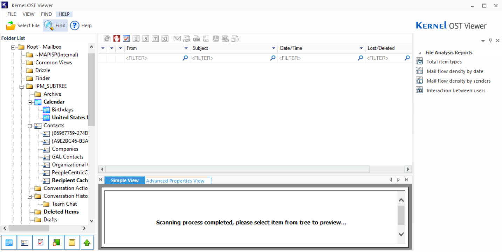
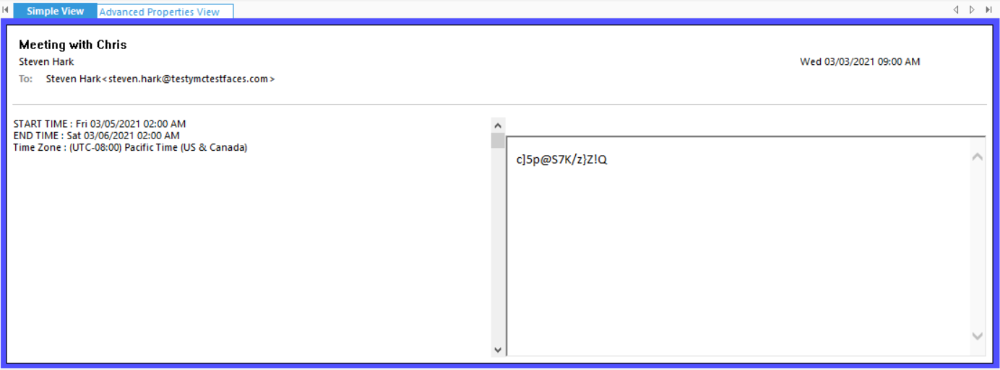
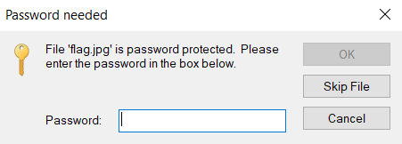

# FE01
## BRIEFING
Download the file and find a way to get the flag.

Contents: fe01.ost

## Solution

After initially attempting to simply open the .ost file in Outlook (and it not working) I found a tool called Kernel OST Viewer which made short work of opening the file.

