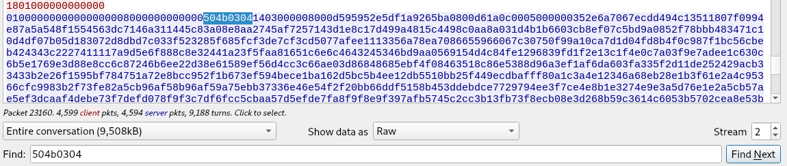

# FH01
## BRIEFING
Download the file and find a way to get the flag.

Contents: fh01.pcapng

## Solution

I did not figure this one out during the competition but found a relatively intuitive means of getting the flag after the fact.

Looking through the pcap I honed in on `udp.stream eq2` due to the presence of a `1.jpg` and a `JFIF` at the beginning of the stream. This hinted that there was some kind of image being transmitted over UDP.

Suspecting that there would be a zip file containing the jpg I took the [file signature](https://en.wikipedia.org/wiki/List_of_file_signatures) bytes for a zip file, `50 4b 03 04` and searched for them in the `raw` data of the UDP stream.

AAAANNNNNDDDDD I found it:



The zip file was split into multiple packets. I copied 32 of them into a text file. I then made a short python script to strip newlines from the file to yield a single byte stream:

```py
root@osboxes:~/Downloads/fh01# cat combine.py 
with open('bytes.txt') as f:
    lines = f.readlines()
    output = ''
    for line in lines:
        output += line.strip('\n')
    print output
```

I did a reverse hex dump on the byte stream and then used 7-zip to extract the contents of the file. Despite an error, 7-zip was able to generate a .jpg file. It became apparent that each packet contained a row (or multiple rows of bytes) and the more packets I added to my text file the more of the flag I revealed.


```console
root@osboxes:~/Downloads/fh01# python combine.py | xxd -r -p > flag.zip
root@osboxes:~/Downloads/fh01# 7z x flag.zip 

7-Zip [64] 16.02 : Copyright (c) 1999-2016 Igor Pavlov : 2016-05-21
p7zip Version 16.02 (locale=en_US.UTF-8,Utf16=on,HugeFiles=on,64 bits,2 CPUs Intel(R) Core(TM) i7-8750H CPU @ 2.20GHz (906EA),ASM,AES-NI)

Scanning the drive for archives:
1 file, 65536 bytes (64 KiB)

Extracting archive: flag.zip

ERRORS:
Unexpected end of archive

--
Path = flag.zip
Type = zip
ERRORS:
Unexpected end of archive
Physical Size = 572040

    
Would you like to replace the existing file:
  Path:     ./5.jpg
  Size:     93857 bytes (92 KiB)
  Modified: 2021-02-25 11:08:26
with the file from archive:
  Path:     5.jpg
  Size:     793302 bytes (775 KiB)
  Modified: 2021-02-25 11:08:26
? (Y)es / (N)o / (A)lways / (S)kip all / A(u)to rename all / (Q)uit? y

ERROR: Data Error : 5.jpg
            
Sub items Errors: 1

Archives with Errors: 1

Open Errors: 1

Sub items Errors: 1
```

When I constructed the zip file from 32 packets, it was enough to yield the flag:


The flag is **C4tch1ng_H0n3y_p0Ts_w1TH_a_Sh4rk!**
