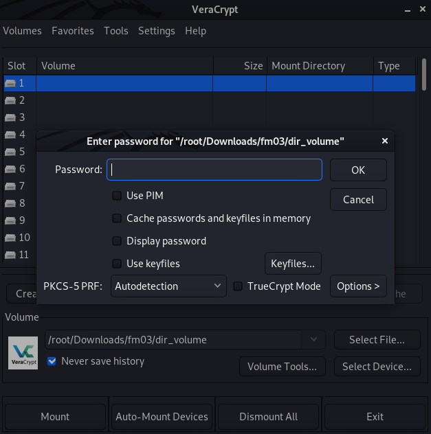
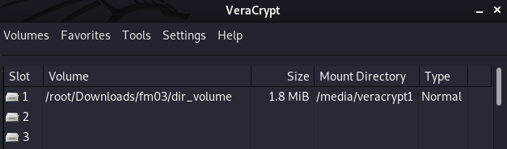
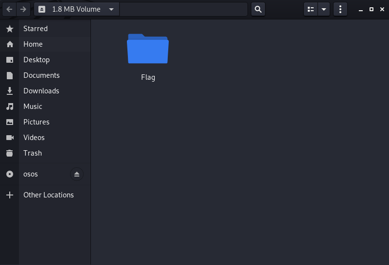
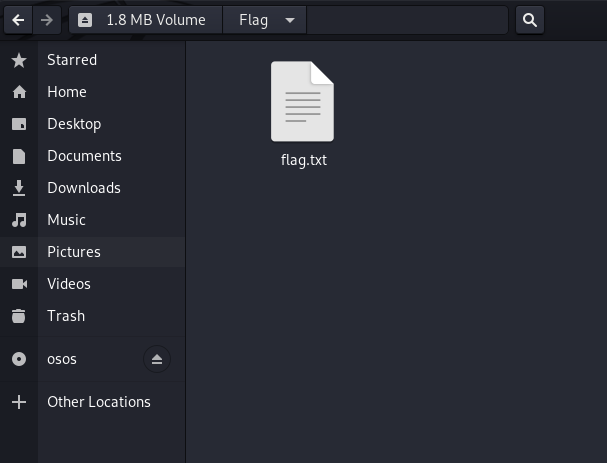

# FM03
## BRIEFING
Download the Veracrypt volume and find a way to get the flag.

Contents: dir_volume

## Solution

Midway through the competition a hint was released that `dir_volume` was a VeraCrypt encrypted volume (and that there were 0 solves at that point in time).

In order to have a shot at cracking the password used to encrypt the drive, we first want to pull the hash from the volume. I found the instructions for doing so here: https://hashcat.net/forum/thread-6694.html. Following the forum post, I extracted the hash via the dd utility (dd is a command-line utility for Unix and Unix-like operating systems, the primary purpose of which is to convert and copy files):

```console
root@osboxes:~/Downloads/fm03# dd if=dir_volume of=hash.txt bs=512 count=1
1+0 records in
1+0 records out
512 bytes copied, 9.3799e-05 s, 5.5 MB/s
```

For context, according to the site here: https://linuxhint.com/get_data_encrypted_drive/, in order to crack a VeraCrypt volume with HashCat, we need to provide HashCat with the binary data containing hashes and encryption info. This is found in the first 512 bytes of the VeraCrypt volume. Hence, we used dd to extract the first 512 bytes.

Now we send these 512 bytes to HashCat:

```console
root@osboxes:~/Downloads/fm03# hashcat -a 0 -m 13722 hash.txt /usr/share/wordlists/rockyou.txt --force
hashcat (v6.1.1) starting...

You have enabled --force to bypass dangerous warnings and errors!
This can hide serious problems and should only be done when debugging.
Do not report hashcat issues encountered when using --force.
OpenCL API (OpenCL 1.2 pocl 1.6, None+Asserts, LLVM 9.0.1, RELOC, SLEEF, DISTRO, POCL_DEBUG) - Platform #1 [The pocl project]
=============================================================================================================================
* Device #1: pthread-Intel(R) Core(TM) i7-8750H CPU @ 2.20GHz, 7856/7920 MB (2048 MB allocatable), 2MCU

Minimum password length supported by kernel: 0
Maximum password length supported by kernel: 64

Hashes: 1 digests; 1 unique digests, 1 unique salts
Bitmaps: 16 bits, 65536 entries, 0x0000ffff mask, 262144 bytes, 5/13 rotates
Rules: 1

Applicable optimizers applied:
* Zero-Byte
* Single-Hash
* Single-Salt
* Slow-Hash-SIMD-LOOP
* Uses-64-Bit

Watchdog: Hardware monitoring interface not found on your system.
Watchdog: Temperature abort trigger disabled.

Host memory required for this attack: 64 MB

Dictionary cache hit:
* Filename..: /usr/share/wordlists/rockyou.txt
* Passwords.: 14344385
* Bytes.....: 139921507
* Keyspace..: 14344385

hash.txt:redwings                                
                                                 
Session..........: hashcat
Status...........: Cracked
Hash.Name........: VeraCrypt SHA512 + XTS 1024 bit
Hash.Target......: hash.txt
Time.Started.....: Sun Apr 18 14:46:51 2021, (18 mins, 33 secs)
Time.Estimated...: Sun Apr 18 15:05:24 2021, (0 secs)
Guess.Base.......: File (/usr/share/wordlists/rockyou.txt)
Guess.Queue......: 1/1 (100.00%)
Speed.#1.........:        4 H/s (3.55ms) @ Accel:64 Loops:125 Thr:1 Vec:4
Recovered........: 1/1 (100.00%) Digests
Progress.........: 4992/14344385 (0.03%)
Rejected.........: 0/4992 (0.00%)
Restore.Point....: 4864/14344385 (0.03%)
Restore.Sub.#1...: Salt:0 Amplifier:0-1 Iteration:499875-499999
Candidates.#1....: daryl -> david123

Started: Sun Apr 18 14:46:45 2021
Stopped: Sun Apr 18 15:05:27 2021
```

After approximately 20 minutes, HashCat successfully cracked the hash and gave us the password **redwings**.

We open up VeraCrypt and enter the password:



We successfully decrypted the volume: 



Double-clicking reveals the volume contained a folder called `Flag`:



Double-clicking the folder reveals a `flag.txt` text file:



Opening the text file reveals the flag:


The flag is **Us3_5tr0ng_P@55w0Rds!**
