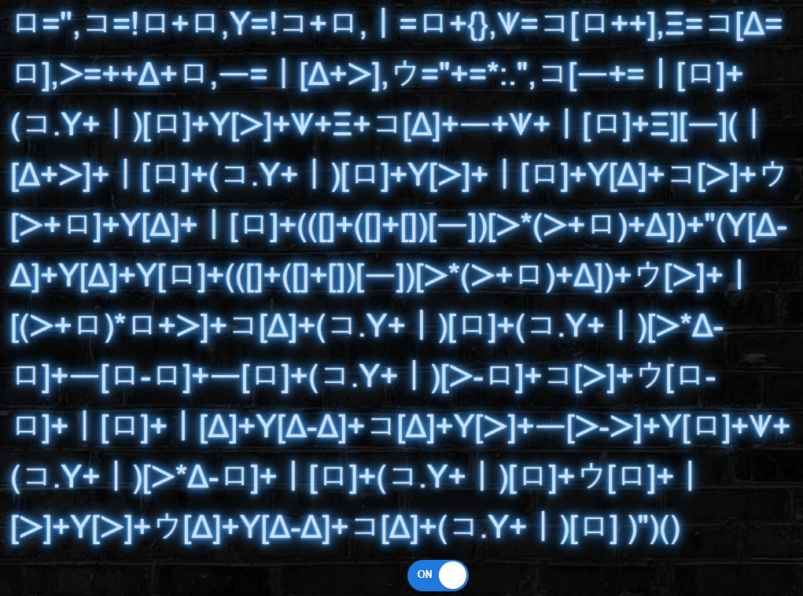
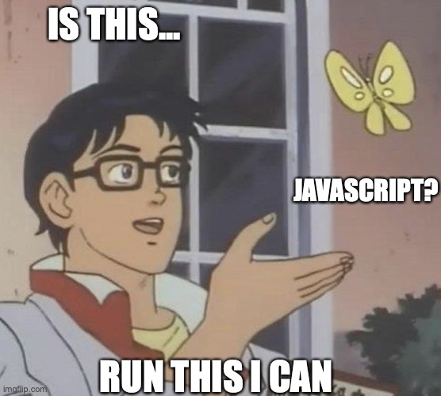

# WE01
## BRIEFING
View the page at https://cfta-we01.allyourbases.co and try to get the flag.

Note: If you have an anti-malware product which reports a warning for this webpage, it's a false positive that can be ignored.

## Solution

The main page of the site simply presents some kind of glyphic text and allows us to click a button that toggles whether or not the text glows. If we copy a snippet of the text and do a google search we find that the text is in Aurebesh, a written form of a Star Wars language. I eventually found the site https://aem1k.com/aurebesh.js/ that suggested javascript could be translated into other languages.

Towards the end of the competition the following hint was released:

If we paste the text into the developer console we are presented with the flag

The flag is **unicode+obfuscation=js*fun**.

