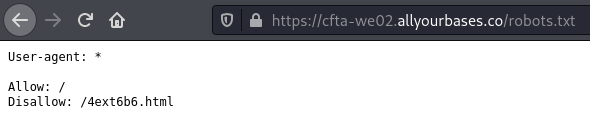
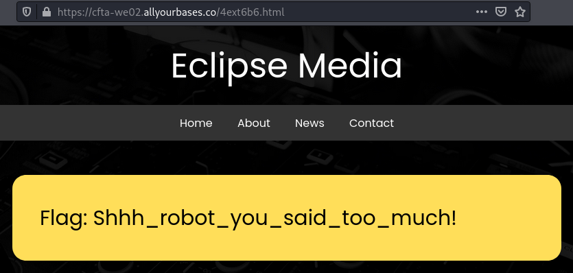

# WE02
## BRIEFING
View the page at https://cfta-we02.allyourbases.co and try to get the flag.

## Solution

The robots exclusion standard, also known as the robots exclusion protocol or simply robots.txt, is a standard used by websites to communicate with web crawlers and other web robots. The standard specifies how to inform the web robot about which areas of the website should not be processed or scanned. If we navigate to /robots.txt we find the following:

If we navigate to the disallowed entry we find the following:

The flag is **Shhh_robot_you_said_too_much!**.

