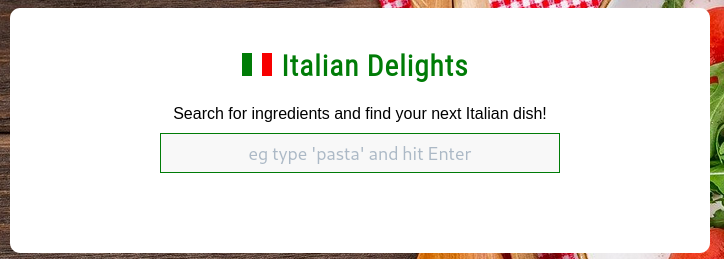
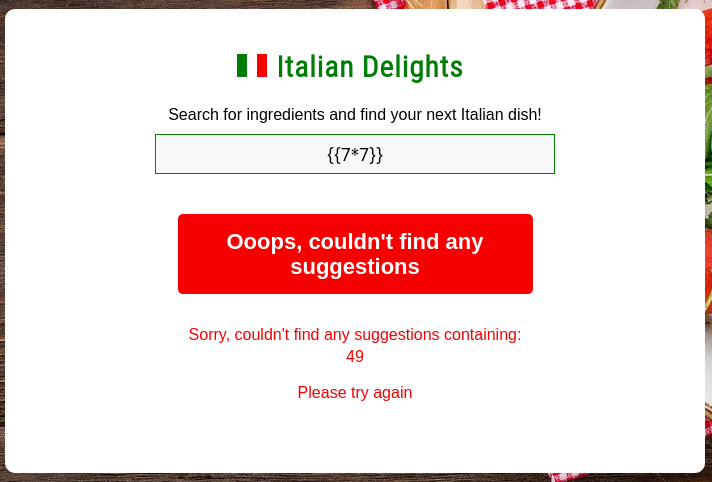
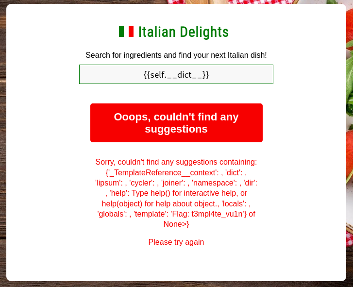

# WM04
## BRIEFING
Visit the Italian dish suggestion site at https://cfta-wm04.allyourbases.co and find a way to get the flag.

## Solution

The initial page presents us with a search box to ostensibly for us to search for ingredients for Italian dishes:

After playing around a little bit I checked whether the search field might be vulnerable to Server Side Template Injection (SSTI). The payload for the test was `{{7*7}}`:

Sure enough, the computation executed and displayed the result (`49`). After attempting a few payloads I found one that displayed the flag:

The flag is **t3mpl4te_vu1n**.
