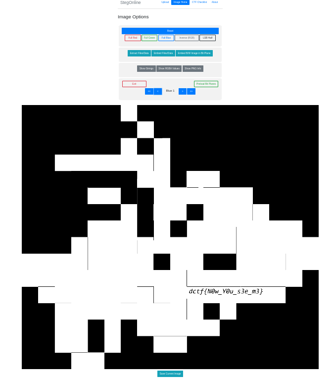

Stegonography challenge. If we flipped through the bit planes via [stegonline](https://stegonline.georgeom.net/upload) we would eventually come across the flag:

The flag is **dctf{N0w_Y0u_s3e_m3}**.
