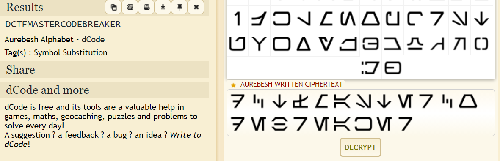

The phrasing of the name of the challenge is a hint. The image contains a line of text in what looks like a glyphic alphabet. The alphabet happens to be Aurebesh, a language from Star Wars. We can find a decryptor online to convert the text to English.

Using dcode yields:

The flag is: **dctf{MASTERCODEBREAKER}**.
