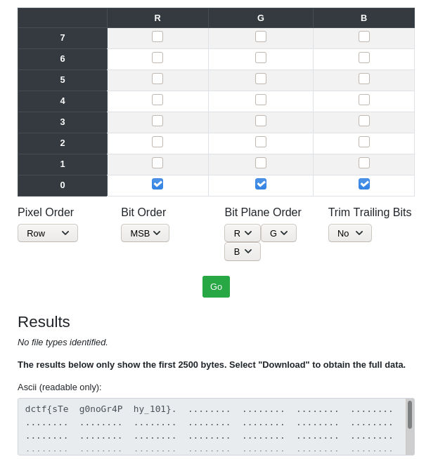

We are provided an image file. Pulling the LSB from each pixel of the image yields the flag. We can use [stegonline](https://stegonline.georgeom.net/upload) to make short work of this challenge:

The flag is **dctf{sTeg0noGr4Phy_101}**.
