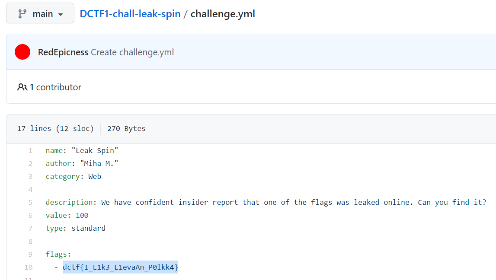

The hint tells us that the CTF organizers only control a limited amount of space on the internet. We were search around for "DragonSec SI" we come across their GitHub which has a file for the "DCTF1-chall-leak-spin" problem. We find the flag in this file:

The flag is **dctf{I_L1k3_L1evaAn_P0lkk4}**
