## Problem ##

A game that zh3r0 guys asked for 😥
Note: Solve all the levels and then click submit the solution button and wait for 40 seconds to get the flag.

## Solution ##

This challenge contained a series of puzzles to be solved with assembly code. We were provided with 8 registers to store information and our goal was to move our jellyfish-like character to the stairs in each level. They started pretty basic, just moving the character up, down, left, or right. The difficulty gradually incleased until on the final level we had to determine which direction (left or right) to take our jellyfish based on whether a pseudo-random number is prime.

Here is the page we start at:

Here is the MAN page containing descriptions of all available commands:

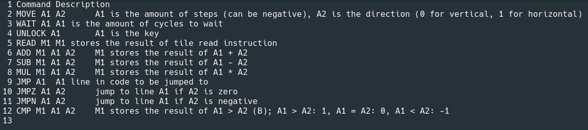

Below are my solutions for each level.

Level 0:

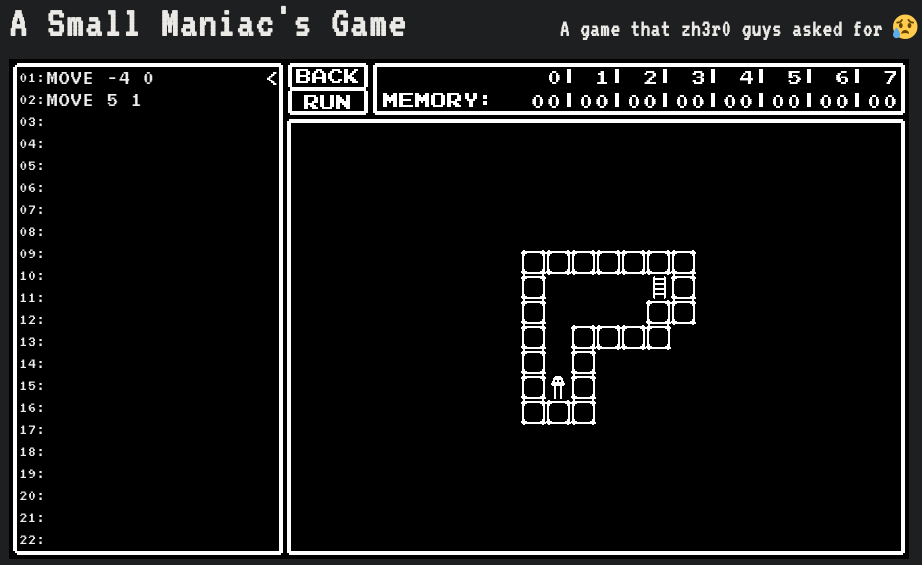

Level 1:

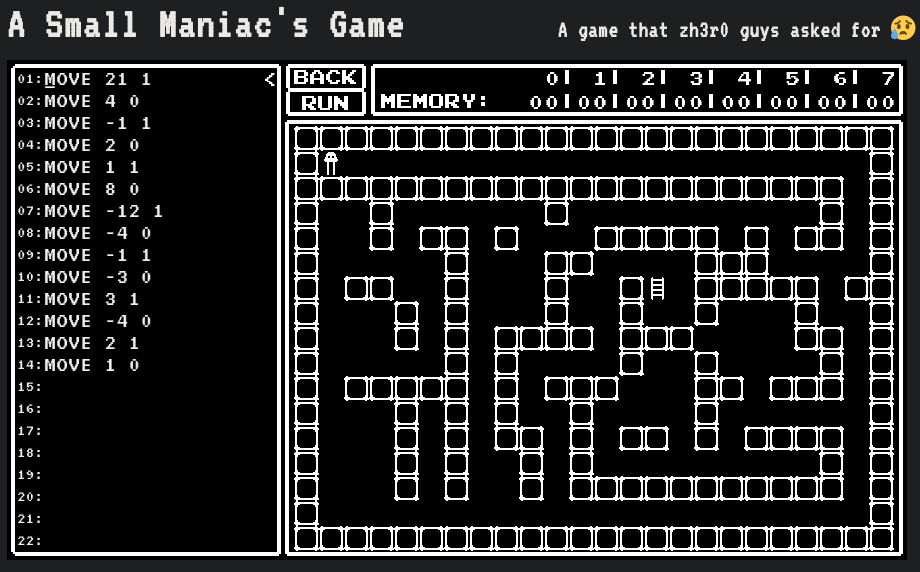

Level 2:

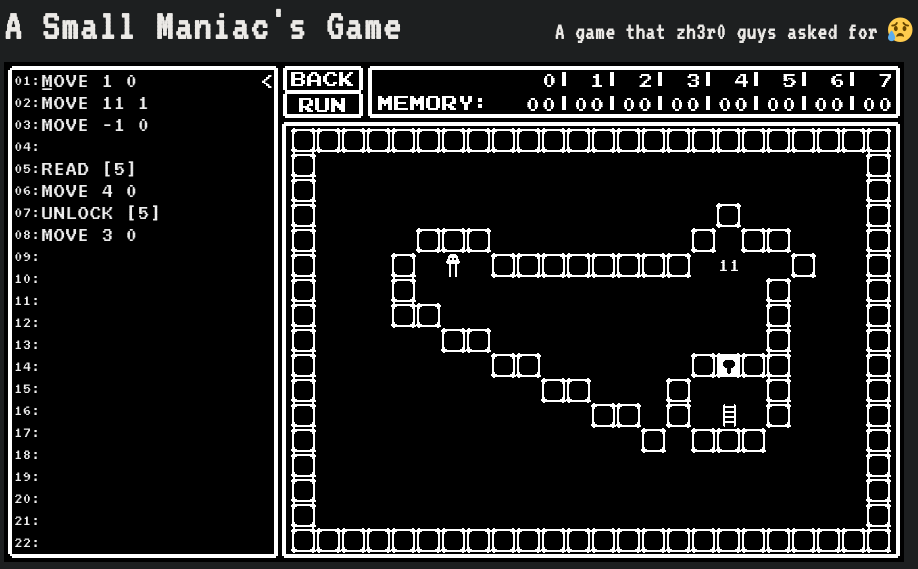

Level 3:

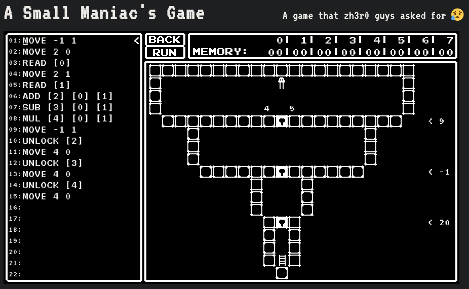

Level 4:

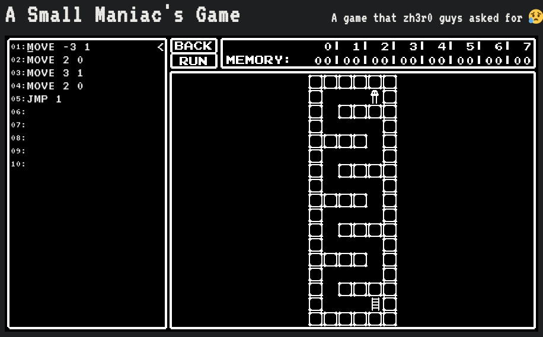

Level 5:

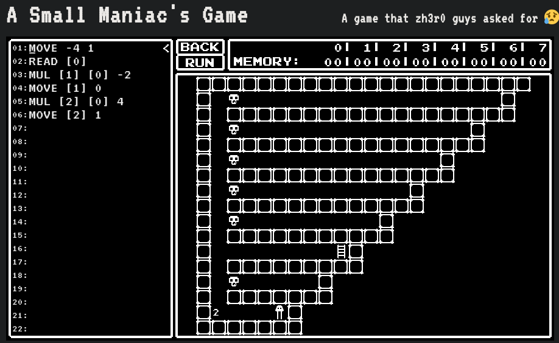

Level 6:

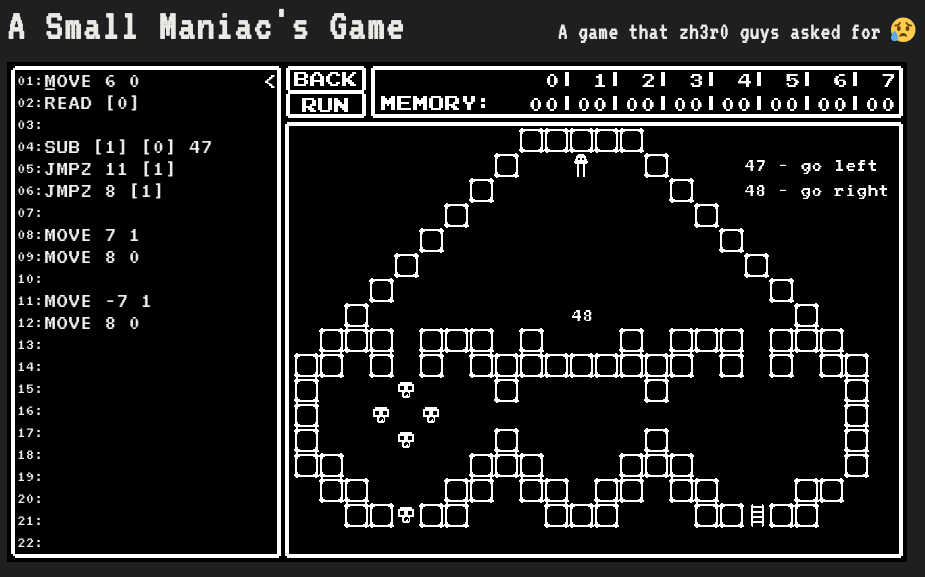

Level 7:

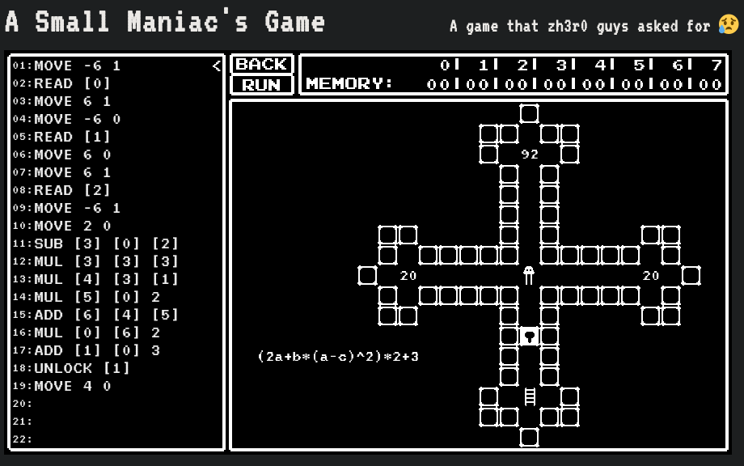

Level 8:

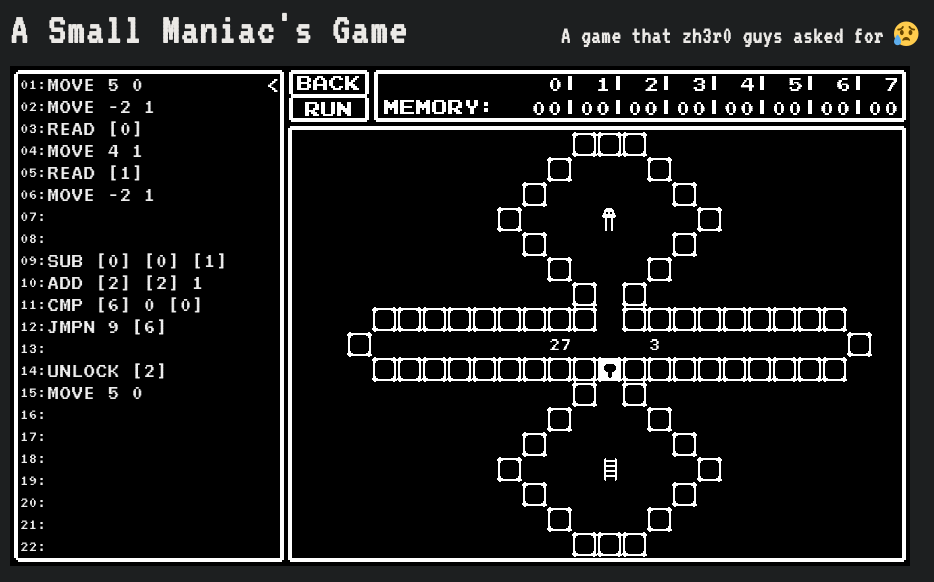

Level 9:

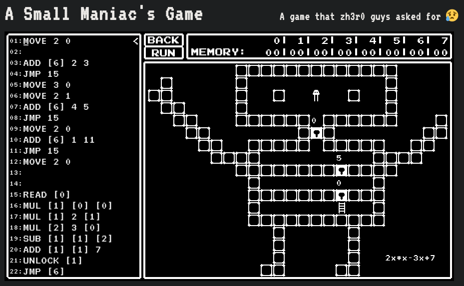

Level 10:

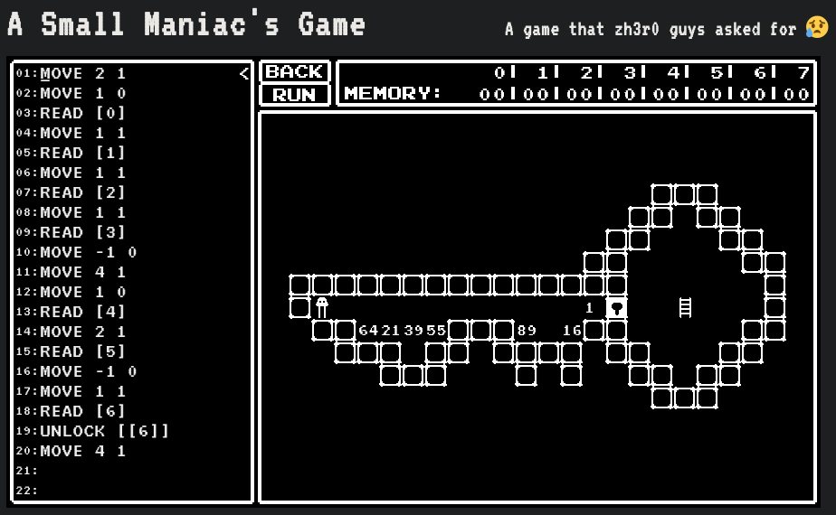

Level 11:

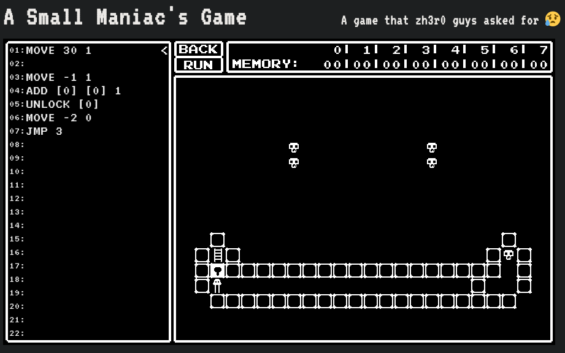

Level 12:

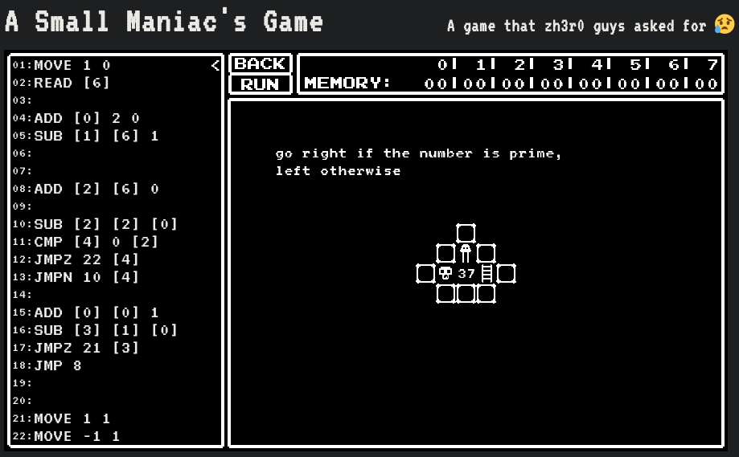

And here is the flag:

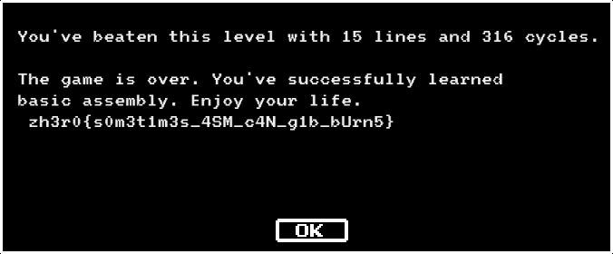

